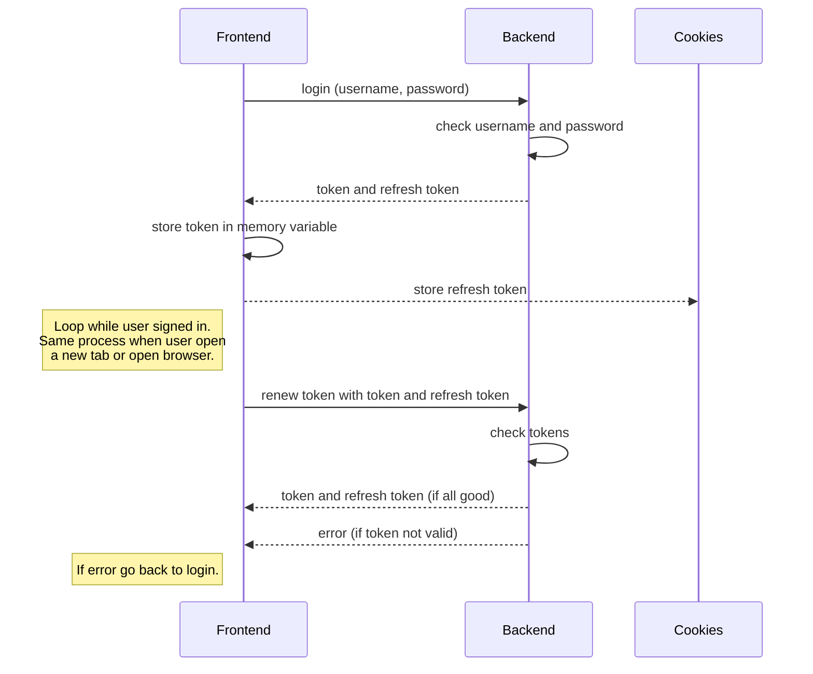

# Welcome to SPURR!

A lot of fresh and experienced CS practitioners experience difficulty going through CS interviews. The interview process for CS roles is craggy and difficult to traverse. Thus, I wrote this application for me and my friends to store and share interview questions that we experience. You're welcome to add questions, solutions, and discussions on the website. You're also welcome to contribute to this project and have it on your resume as a project you helped build. It's very simple application as you can see in the UI and the code, my goal was to make it useful and easy to use. This is the frontend code, the backend code link is provided below as well. Feel free to contact me if you have any questions or suggestions. Thank you for checking out **Spurr**!

## Why I built it
- Me and my friends complained about a lot of unorganized folders for interview questions on our computers.
- Wanted a way to share these questions between us too.
- I wanted a simple solution, easy UI, free to use.
- I didn't want the questions be traced back to a user, so everyone can submit questions anonymously.
- Yes, glassdoor exists, but I like my simple UI and focused application mission. (I'm biased towards my project :D)
- Also it was one of my goals for 2022 which is build three personal projects, to learn and practice "new" concepts.

## Contribution
I welcome all ideas, suggestions, and code contribution to the frontend or the backend project. The frontend is written in react with javascript plus bootstrap and MUI, the backend is written in nodejs with postgres for the database. Create a ticket, git clone the project, create a branch with patch/minor/major, and submit your merge request. There is a pre-commit git hook that will be installed on first **npm install** which will ensure the package.json and package-lock.json will update with every commit according to the branch name. Thus, please ensure your branch name follows the standard naming **(patch/minor/major)/issueNumber**. Thank you, and looking forward for your contributions!

## To Run Locally

- Create a .env file with the following:
**REACT_APP_BASE_URL="http://hostname:port"**
- Replace the hostname and the port with the backend server url.
- npm install
- npm start

Note: the backend code has the postgres database design that's needed for the project.
 
## Backend Code

The backend is written in nodejs. It has a simple documentation like this in its repo too. It's located at [spurr-backend](http://github.com/aalzubidy).

## Architecture and Design Notes

**src** files structure:
* **API**: Contains custom axios instance that will handle passing the token in the header to the backend.
* **AppRouter**: Contains the router for the project, the paths, and a custom private route component.
* **Contexts**: This contains the authentication context which handles login, logout, and storing the token and refresh token in the application. There is a diagram below to show the token storage approach.
* **Components**: The various projects' components.

Here is the authentication process diagram

